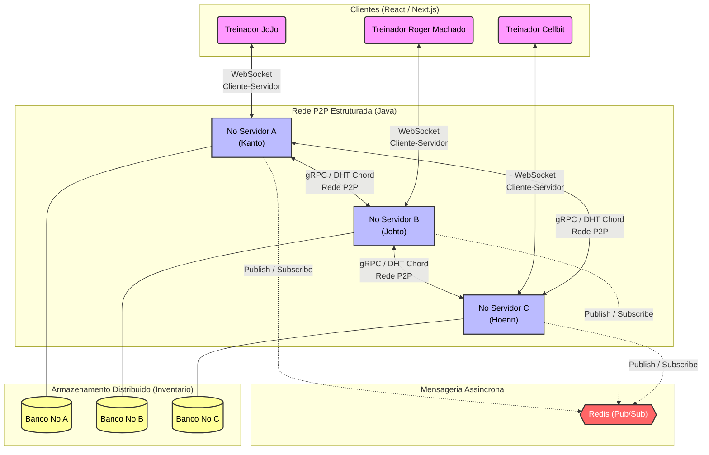

# Sistema Distribuído de Coleção e Troca de Pokémon (NFTs)

## Sobre o Projeto
O sistema implementa uma infraestrutura distribuída inspirada na dinâmica de colecionismo de Pokémon. Seu objetivo principal é construir uma plataforma descentralizada e tolerante a falhas onde cada Pokémon atua como um ativo digital único (NFT) com atributos variáveis (IVs). Os usuários podem interagir em um chat global em tempo real, competir por capturas (spawns aleatórios) e realizar trocas diretas de forma segura através do "PC", um sistema de armazenamento persistente e distribuído.

---

## Arquitetura do Sistema: O Modelo Híbrido

Para garantir que o sistema não dependa de um servidor centralizado (sujeito a um ponto único de falha) e, ao mesmo tempo, evite que clientes manipulem as regras do jogo, a topologia adota uma **Arquitetura Híbrida**. Ela é dividida em duas grandes camadas com padrões de comunicação e responsabilidades distintos:

### 1. Camada de Acesso: Cliente-Servidor (Frontend)
A interação com o usuário final ocorre via um modelo estrito de **Cliente-Servidor**, utilizando WebSockets.
* **Funcionamento:** Os navegadores dos jogadores atuam como clientes leves (*Thin Clients*). Eles não participam do armazenamento distribuído e apenas enviam intenções de ação (ex: "tentar capturar"). Um dos nós servidores recebe esse pedido e atua como a autoridade central que valida a requisição, garantindo a segurança do estado do jogo contra trapaças na ponta do cliente.

### 2. Camada de Infraestrutura: P2P Estruturado (Backend)
A inteligência de negócios, coordenação e persistência de dados ocorrem exclusivamente na comunicação entre os nós servidores, que operam internamente como uma rede **Peer-to-Peer (P2P) Estruturada**. Esta camada resolve os principais desafios clássicos de Sistemas Distribuídos:

#### A. Nomeação e Armazenamento: O "PC" (DHT Chord)
O inventário dos jogadores não é salvo em um banco de dados relacional clássico.
* **Modelo:** Implementação de uma Tabela de Espalhamento Distribuída (**DHT**) baseada no algoritmo **Chord**.
* **Funcionamento:** A rede de servidores forma um anel lógico. Cada Pokémon capturado recebe um identificador plano único (Hash) e é armazenado no nó responsável por aquele segmento do anel. Isso resolve o problema de Nomeação, garante o balanceamento de carga entre as máquinas e permite que a busca por um ativo ocorra em complexidade algorítmica de $O(\log N)$.

#### B. Coordenação e Exclusão Mútua: Capturas e Trocas
As transações críticas do jogo exigem garantias rígidas de consistência entre os nós pares.
* **Concorrência de Captura:** Se múltiplos jogadores (conectados a nós diferentes) tentarem capturar o mesmo Pokémon no exato mesmo milissegundo, o sistema utiliza algoritmos de **Exclusão Mútua Distribuída** (*Distributed Locks*) entre os nós para garantir a atomicidade da operação. Apenas a primeira requisição adquire o bloqueio, evitando a clonagem de ativos.
* **Trocas P2P (Trade):** Durante a troca direta de ativos entre dois jogadores, o sistema coordena uma transação segura utilizando comunicação síncrona (gRPC) entre os nós correspondentes. Caso ocorra uma queda de rede em qualquer um dos processos durante a operação, a transação sofre *rollback*, prevenindo a perda ou duplicação de Pokémon.

#### C. Comunicação Assíncrona: Chat Global e Spawns (Pub/Sub)
A dinâmica de eventos em tempo real foi isolada do núcleo transacional do anel P2P.
* **Middleware:** Utilização do **Redis** com o padrão **Publish/Subscribe**.
* **Funcionamento:** Quando a lógica do jogo decide gerar um Pokémon selvagem, o evento é publicado em um tópico global (*Fire and Forget*). Todos os nós da rede recebem a notificação de forma simultânea, ordenada e assíncrona, repassando a informação aos clientes conectados. Isso garante alta performance e elimina o acoplamento temporal entre os servidores.

---

## Arquitetura do Sistema

---

## Especificação de Mensagens e Protocolos

Para suportar a arquitetura descentralizada, o sistema utiliza diferentes protocolos de comunicação dependendo da necessidade de consistência ou velocidade da operação. Abaixo estão detalhados os "payloads" (conteúdos) das mensagens trocadas no sistema, divididas por módulos.

---

### 1. Módulo PC (Armazenamento Distribuído - DHT)
Gerencia o inventário persistente dos jogadores utilizando uma rede P2P estruturada (Chord).

**Comunicação Cliente ➔ Servidor (Visualização):**
* `Solicitar Inventario`: `<ID_Treinador>`
* `Resposta Inventario`: `<Lista [ID_Pokemon, Especie, Atributos], Status>`

**Comunicação Servidor ➔ Servidor (Interna P2P):**
* `DHT Lookup`: `<Hash(ID_Treinador)>` 
  > *Descrição: O nó local roteia essa mensagem pelo anel lógico (Chord) para descobrir qual IP guarda a caixa do jogador solicitado.*
* `Transferencia Posse (Update)`: `<ID_Pokemon, Novo_ID_Treinador>` 
  > *Descrição: Atualiza o dono do ativo digital no banco de dados distribuído após uma troca bem-sucedida.*

---

### 2. Módulo de Troca (Consenso e Exclusão Mútua)
Gerencia a negociação P2P direta entre dois treinadores. Utiliza um modelo simplificado de *Two-Phase Commit* (Commit de Duas Fases) para evitar clonagem ou perda de Pokémon caso a rede falhe.

**Comunicação Cliente ➔ Servidor (Interação do Usuário):**
* `Enviar Solicitacao Troca`: `<ID_Treinador_Origem, ID_Treinador_Destino>`
* `Resposta Solicitacao`: `<ID_Solicitacao, Status_Aceite>`
* `Selecionar Pokemon`: `<ID_Solicitacao, ID_Pokemon>`
* `Confirmar Troca (Ready)`: `<ID_Solicitacao, ID_Treinador>`

**Comunicação Servidor ➔ Servidor (Transação Distribuída):**
* `Acquire Lock Pokemon`: `<ID_Pokemon, ID_Solicitacao>` 
  > *Descrição: Aplica exclusão mútua. Bloqueia o Pokémon no banco de dados para impedir que ele seja transferido ou capturado por outro processo concorrente durante a negociação.*
* `Commit Trade`: `<ID_Solicitacao, Transacao_Hash>` 
  > *Descrição: Efetiva a troca atômica nos dois nós simultaneamente e libera os Locks.*
* `Rollback / Cancelar Troca`: `<ID_Solicitacao>` 
  > *Descrição: Aborta a operação e libera os Locks caso um dos nós caia (Time-out) ou um usuário recuse.*

---

### 3. Módulo de Chat Global (Pub/Sub)
Gerencia a comunicação assíncrona em tempo real utilizando Redis Pub/Sub.

**Mensagens do Tópico Global:**
* `Enviar Mensagem`: `<ID_Treinador, String_Mensagem, Timestamp_Local>`
  > *Descrição: O uso do Timestamp garante a ordenação causal das mensagens na tela dos clientes, mitigando os atrasos de rede.*

---

### 4. Módulo de Spawn e Captura (Coordenação de Concorrência)
Gerencia a geração procedural de recursos e a resolução de condições de corrida (vários jogadores tentando capturar o mesmo Pokémon no mesmo milissegundo).

**Comunicação Servidor (Líder) ➔ Pub/Sub (Anúncios):**
* `Spawnar Pokemon`: `<UUID_Pokemon, Especie, Lista_Atributos_IVs, Timestamp_Spawn>`
  > *Descrição: Os atributos imutáveis são gerados no momento do spawn pelo nó que atua como Coordenador.*
* `Anuncio Captura`: `<UUID_Pokemon, ID_Treinador, Nome_Treinador>`

**Comunicação Cliente ➔ Servidor (Ação do Jogador):**
* `Jogar Pokebola`: `<ID_Treinador, UUID_Pokemon, Timestamp_Tentativa>`
  > *Descrição: O Timestamp da tentativa resolve desempates caso duas requisições cheguem ao servidor no mesmo ciclo de processamento.*

**Comunicação Servidor ➔ Cliente (Resoluções de Captura):**
* `Confirmacao Captura`: `<ID_Treinador, UUID_Pokemon>`
* `Falha na Captura`: `<Motivo, UUID_Pokemon>`
  * *Motivo 1: `FALHA_SORTE` (O RNG determinou que o Pokémon escapou da pokébola).*
  * *Motivo 2: `FALHA_DESPAWN` (O tempo do Pokémon no mapa expirou).*
  * *Motivo 3: `FALHA_JA_CAPTURADO` (Outro jogador adquiriu o Lock do banco de dados antes).*
 
## Nomeação (Naming)

**1. Quais recursos precisam ser nomeados/identificados?**
Em nosso sistema, três entidades fundamentais exigem identificadores únicos para que a rede distribuída opere sem ambiguidades:
* **Ativos Digitais (Pokémon/NFTs):** Cada criatura capturada recebe um ID único para garantir a posse no banco de dados, permitir transferências e possibilitar o bloqueio lógico (lock) durante as transações de troca.
* **Treinadores (Jogadores):** Identificadores de usuário para vincular os ativos do armazenamento aos seus respectivos donos e rotear as sessões.
* **Nós Servidores (Instâncias Java):** Identificadores numéricos para que cada nó da rede participe e seja localizado dentro do anel de roteamento P2P.

**2. Qual esquema de nomeação?**
Utilizaremos o esquema de **Nomeação Plana (Flat Naming)**.
* **Justificativa:** Os identificadores (como Hashes criptográficos ou UUIDs) não contêm informações legíveis, hierárquicas ou geográficas sobre onde o recurso está armazenado. O "Pikachu do Treinador JoJo" será convertido em um hash opaco (ex: `8f4a2b...`). Isso é fundamental para que o algoritmo consiga distribuir os dados de forma matematicamente balanceada, ignorando a semântica ou origem do item no jogo.

**3. Dado o esquema, qual mecanismo de resolução de nomes?**
O mecanismo de resolução será uma **Tabela de Espalhamento Distribuída (DHT)**, implementada através do algoritmo **Chord**.
* **Justificativa:** Como a nomeação é plana, o cliente não consegue deduzir em qual servidor físico o seu Pokémon está guardado apenas olhando para o ID. A requisição chega ao nó Gateway (ao qual o cliente está conectado), que aplica a função Hash sobre o ID do Pokémon e consulta sua *Finger Table* (tabela de roteamento interna do Chord) para descobrir matematicamente qual nó detém aquele recurso. Isso resolve o nome e localiza o dado com complexidade de busca de $O(\log N)$.

---

## Processos (Processes)

**1. Faz sentido usar threads?**
Sim, o uso de múltiplas threads é **obrigatório** para a viabilidade do backend.
* **Justificativa:** O servidor Java precisará lidar com alta concorrência. Utilizaremos *Thread Pools* dedicadas para separar responsabilidades: threads exclusivas para manter as conexões WebSocket com os clientes, threads para processar as chamadas remotas P2P (gRPC) sem bloquear a interface de outros usuários, e threads em *background* rodando rotinas de tolerância a falhas (sinais de *heartbeat*) e escutando publicações do Redis.

**2. Servidores Stateful ou Stateless?**
Para a camada de rede P2P (Backend Java), os servidores serão fortemente **Stateful (Com Estado)**.
* **Justificativa:** Diferente de uma API web comum (Stateless), nossa arquitetura exige que cada nó guarde o estado atual da rede na memória RAM. Eles precisam manter sua *Finger Table* atualizada (quem são seus vizinhos no anel P2P), gerenciar as sessões abertas de WebSocket e rastrear rigorosamente os *Locks* (travas de exclusão mútua) ativos durante as transações de troca em andamento.

**3. Faz sentido usar técnicas de virtualização?**
Sim, o projeto utilizará virtualização em nível de sistema operacional através de **Containerização (Docker)**.
* **Justificativa:** Não utilizaremos Máquinas Virtuais (VMs) tradicionais devido ao alto overhead de consumo de hardware (Hypervisor). O Docker nos permite empacotar a aplicação Java, o Redis e os bancos de dados leves em containers isolados. Isso resolve conflitos de dependências e permite simular a execução de múltiplos nós distribuídos em portas diferentes (`localhost:8081`, `8082`, `8083`) simultaneamente em uma única máquina de desenvolvimento para a apresentação acadêmica.

## Coordenação

**1. Será necessário algum mecanismo de sincronização? Relógio Real ou Lógico?**
Sim, a sincronização é fundamental, e utilizaremos **Relógios Lógicos (Relógios de Lamport)**.
* **Justificativa:** Em um sistema distribuído, depender de Relógios Físicos (mesmo com sincronização via NTP) é perigoso devido ao desvio (*clock skew*). Se dois treinadores (conectados a nós diferentes) tentarem capturar o mesmo Pokémon gerado no mapa, não importa quem clicou no "milisegundo real" exato, pois os relógios das máquinas podem divergir. O Relógio de Lamport garante a **ordenação causal** dos eventos. O sistema registrará os carimbos de tempo lógico (timestamps) das requisições, garantindo que a rede processe os eventos na ordem correta e entre em consenso sobre quem foi o primeiro a solicitar a captura.

**2. Será necessário empregar exclusão mútua (distribuída)? Qual algoritmo?**
Sim, é estritamente necessária para evitar o problema crítico de *Double Spending* (clonagem de ativos/Pokémon) durante trocas e capturas concorrentes. 
* **Algoritmo Escolhido:** Utilizaremos uma adaptação do **Algoritmo Centralizado por Recurso** (alavancando a arquitetura da DHT).
* **Justificativa:** Como utilizamos o algoritmo Chord, cada ativo (Pokémon) possui um nó específico responsável por ele (determinado pelo Hash). Quando uma transação de troca (Trade) se inicia, o nó responsável atua temporariamente como o Coordenador da Exclusão Mútua para aquele ativo específico. Ele concede a trava (*Lock*) de acesso exclusivo para a transação e enfileira (ou rejeita) quaisquer outras tentativas de acesso até que a transação receba o *commit* ou *rollback*, garantindo a atomicidade e liberando o recurso (Unlock) logo em seguida.

**3. Será necessário um algoritmo de eleição? Qual?**
Sim, algoritmos de eleição são necessários para cenários de tolerância a falhas.
* **Algoritmo Escolhido:** Utilizaremos o **Algoritmo em Anel (Ring Election Algorithm)**.
* **Justificativa:** Nossa rede backend já está estruturada em uma topologia lógica circular devido ao P2P Chord. Se o nó coordenador de uma determinada rotina cair (por exemplo, o nó temporariamente responsável por coordenar a geração aleatória de *Spawns* no mapa), a rede detecta a falha através da interrupção de *heartbeats*. A partir daí, uma mensagem de eleição circula pelo anel, acumulando os IDs dos nós sobreviventes, até dar a volta completa e eleger o nó ativo com o maior ID (ou ID sucessor mais próximo) para assumir a responsabilidade, restaurando o funcionamento sem intervenção manual.

**4. Se vai usar pub/sub, como será implementado?**
A comunicação em grupo para eventos assíncronos será desacoplada da rede P2P estrita, utilizando **Redis Pub/Sub** como *Middleware* de mensageria.
* **Justificativa da Implementação:**
    * **Chat Global:** Quando um jogador envia uma mensagem, o seu respectivo Nó Java (Publisher) publica a mensagem no tópico `chat_global` do Redis. Simultaneamente, todos os outros Nós Java atuam como Inscritos (Subscribers) ouvindo esse tópico. Ao receberem a mensagem do Redis, eles a repassam aos seus respectivos clientes via WebSocket.
    * **Spawns de Pokémon:** A lógica de geração de um Pokémon selvagem publica as coordenadas e os dados do ativo em um tópico `spawns_event`. O padrão de "atire e esqueça" (*Fire and Forget*) do Redis permite que a notificação chegue a todos os jogadores quase em tempo real, sem que os servidores Java fiquem bloqueados esperando a confirmação de recebimento uns dos outros.

## Justificativa da Topologia: Por que 3 Nós Servidores?

Durante o desenho da arquitetura, a principal questão foi determinar onde ocorreria o processamento distribuído e qual a quantidade ideal de nós. A decisão de utilizar exatamente 3 processos servidores no backend (Java) responde a duas necessidades fundamentais da engenharia de sistemas distribuídos:

### 1. Por que não 0 servidores? (A Necessidade de Autoridade)
A hipótese de eliminar os servidores e transferir o anel P2P inteiramente para os navegadores dos jogadores (um modelo 100% P2P no *frontend*) foi descartada por dois motivos críticos:
* **Segurança e Prevenção de Trapaças:** O ambiente do cliente (navegador web) é inerentemente manipulável. Sem um servidor atuando como "juiz" isolado e confiável, usuários mal-intencionados poderiam alterar o código local para forjar capturas, forçar atributos máximos em ativos ou reter requisições de *Lock*. O modelo híbrido confina os clientes e institui o backend como a Autoridade de Validação inquestionável das regras do jogo.
* **Volatilidade de Armazenamento (Churn):** Se a Tabela Hash Distribuída dependesse do armazenamento local dos navegadores, o simples ato de um usuário fechar a aba resultaria na perda permanente dos ativos que estavam sob a custódia lógica daquele cliente.

### 2. Por que exatamente 3? (A Matemática da Distribuição)
Uma vez estabelecida a necessidade de um backend dedicado, a escolha por 3 instâncias não visa a simples redundância (backup), mas representa o **limite matemático inferior** exigido para demonstrar a eficácia dos algoritmos de distribuição propostos:
* **Roteamento Multi-Salto (Multi-Hop):** Utilizar apenas 2 nós criaria uma rede de conexão direta e trivial. Com 3 nós, o anel lógico exige que a *Finger Table* do algoritmo Chord atue de forma plena, provando que um nó consegue rotear mensagens passando por um intermediário na rede até chegar ao seu destino.
* **Quórum e Consenso (Prevenção de *Split-Brain*):** Para evitar o problema do "Cérebro Dividido" — onde uma falha de conexão na rede divide os servidores e faz ambos pensarem que possuem acesso exclusivo ao banco — aplicamos a fórmula de quórum estrito de $2f + 1$. Para o sistema tolerar 1 falha ($f=1$) mantendo a consistência dos *Locks* na exclusão mútua, exige-se no mínimo 3 servidores. Assim, assegura-se que sempre haverá uma maioria justa (2 votos) para arbitrar as transações de troca.
* **Particionamento Real (Sharding):** A configuração com 3 nós comprova a eficácia do particionamento horizontal promovido pela DHT. O espaço de identificadores (IDs dos ativos) é efetivamente fragmentado em três zonas distintas de responsabilidade, provando que o sistema realiza o balanceamento de carga da persistência de dados, diferenciando-se de um espelhamento centralizado tradicional.

## Tecnologias Utilizadas

* **Backend / Nós P2P:** Java 
* **Mensageria / Tempo Real:** Redis (Pub/Sub).
* **Frontend:** A definir
* **Comunicação entre Nós:** Sockets / gRPC.

---

## Como Executar o Projeto

---

## Equipe de Desenvolvimento
Projeto desenvolvido por:

* **André Portela** -
* **Davi Oliveira** -  
* **Eduardo Almeida** - 
* **Júlio Arroio** -

